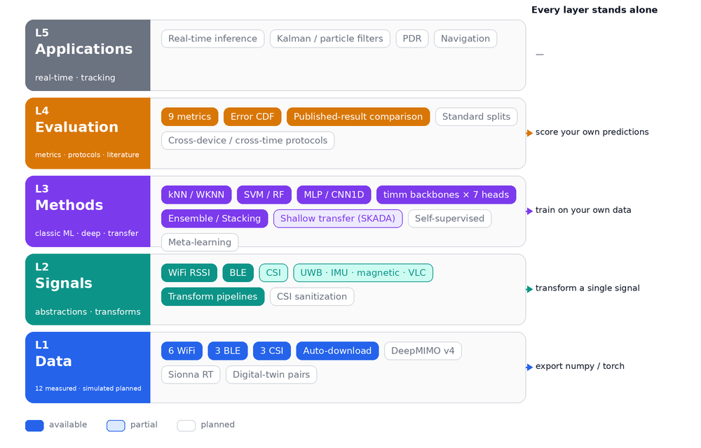

<div align="center">


**IndoorLoc | 室内定位工具库**

*Datasets · Algorithms · Evaluation — one reproducible stack for indoor wireless localization.*

[](https://pypi.org/project/indoorloc/)
[](https://pepy.tech/project/indoorloc)
[](https://github.com/qdtiger/indoorloc/actions/workflows/ci.yml)
[](https://qdtiger.github.io/indoorloc/)
[](https://pypi.org/project/indoorloc/)
[](https://opensource.org/licenses/Apache-2.0)
[](https://github.com/qdtiger/indoorloc)

[📘 Documentation](https://qdtiger.github.io/indoorloc/) |
[🧱 Architecture](#introduction) |
[🛠️ Installation](#installation) |
[🚀 Quickstart](#quickstart) |
[🗂️ Layer by layer](#layer-by-layer) |
[🗺️ Roadmap](#roadmap) |
[🤝 Contributing](#contributing)

[English](README.md) | [中文](README_zh.md)

</div>

---

```python
import indoorloc as iloc

train, test = iloc.load_dataset("ujindoorloc")   # auto-download, unified format
model = iloc.create_model("wknn", k=5)           # classic ML or deep (timm) models
results = model.fit(train).evaluate(test)        # unified metrics
print(results)                                   # mean/median error · floor & building accuracy
```

## Introduction

Indoor-positioning research has a comparability problem: most papers never release code, few public datasets ship standard train/test splits, and published numbers are rarely reproducible across labs. Deployment services, dataset tools, and hundreds of single-paper repos exist — but no framework unifies the three things a benchmark needs: data, algorithms, and evaluation.

IndoorLoc is built to be that missing layer. It is organized as five layers, and **every layer can be used on its own** — take the datasets and leave, run our models on your own data, or score your own model with our metrics.

<p align="center">
  <br>
  <b>Figure</b>: the five-layer architecture. Filled = available, outlined = planned; every layer exposes standard-format entry and exit points.
</p>

<details open>
<summary>Major features</summary>

- **Unified data** — one registry, auto-download, and one sample format across WiFi / BLE / CSI datasets
- **Unified algorithms** — classic ML and deep models behind one `fit / predict / evaluate` API
- **Unified evaluation** — shared metrics (incl. floor/building accuracy) and comparison against published results
- **Config-driven reproducibility** — YAML configs with `_base_` inheritance; any reported result reruns from one command
- **À la carte** — datasets export to standard formats, models train on your own arrays, evaluation scores your own predictions

</details>

## What's New

- **2026-09-03** — Five-layer architecture, per-layer standalone usage, and a public [development plan](docs/DEVELOPMENT_PLAN.md) with the reproducibility contract.
- **2025-12-31** — Literature benchmark tables for every integrated dataset on the [docs site](https://qdtiger.github.io/indoorloc/datasets.html).
- **2025-12-17** — Dataset registry consolidated to 12 integrated datasets; pending datasets documented.
- **2025-12-16** — `indoorloc` 0.1.3 released on [PyPI](https://pypi.org/project/indoorloc/).
- **2025-11-26** — First public release (0.1.0).

## Overview

Every entry links to its implementation.

<table align="center">
  <tbody>
    <tr align="center" valign="bottom">
      <td><b>Datasets (12)</b></td>
      <td><b>Localizers (8)</b></td>
      <td><b>Backbones (3) · Heads (7)</b></td>
      <td><b>Evaluation (9 metrics)</b></td>
    </tr>
    <tr valign="top">
      <td>
        <b>WiFi RSSI</b>
        <ul>
          <li><a href="indoorloc/datasets/ujindoorloc.py">UJIndoorLoc</a></li>
          <li><a href="indoorloc/datasets/sodindoorloc.py">SODIndoorLoc</a></li>
          <li><a href="indoorloc/datasets/longtermwifi.py">LongTermWiFi</a></li>
          <li><a href="indoorloc/datasets/tampere.py">Tampere</a></li>
          <li><a href="indoorloc/datasets/wlanrssi.py">WLANRSSI</a></li>
          <li><a href="indoorloc/datasets/tuji1.py">TUJI1</a></li>
        </ul>
        <b>BLE</b>
        <ul>
          <li><a href="indoorloc/datasets/ble_indoor.py">BLEIndoor</a></li>
          <li><a href="indoorloc/datasets/ibeacon_rssi.py">iBeaconRSSI</a></li>
          <li><a href="indoorloc/datasets/ble_rssi_uci.py">BLE RSSI UCI</a></li>
        </ul>
        <b>CSI</b>
        <ul>
          <li><a href="indoorloc/datasets/csi_fingerprint.py">CSI Fingerprint</a></li>
          <li><a href="indoorloc/datasets/hwild.py">HWILD</a></li>
          <li><a href="indoorloc/datasets/haloc.py">HALOC</a></li>
        </ul>
      </td>
      <td>
        <b>Fingerprinting</b>
        <ul>
          <li><a href="indoorloc/localizers/fingerprint/knn.py">KNN</a></li>
          <li><a href="indoorloc/localizers/fingerprint/knn.py">WKNN</a></li>
          <li><a href="indoorloc/localizers/fingerprint/traditional.py">SVM</a></li>
          <li><a href="indoorloc/localizers/fingerprint/traditional.py">Random Forest</a></li>
        </ul>
        <b>Fusion</b>
        <ul>
          <li><a href="indoorloc/localizers/fusion.py">Ensemble</a></li>
          <li><a href="indoorloc/localizers/fusion.py">Stacking</a></li>
        </ul>
        <b>Transfer</b>
        <ul>
          <li><a href="indoorloc/localizers/transfer.py">TransferLocalizer</a> (SKADA: CORAL · TCA · KMM)</li>
        </ul>
        <b>Deep</b>
        <ul>
          <li><a href="indoorloc/models/localizers/deep_localizer.py">DeepLocalizer</a> (backbone × head)</li>
        </ul>
      </td>
      <td>
        <b>Backbones</b>
        <ul>
          <li><a href="indoorloc/models/backbones/mlp.py">MLP</a></li>
          <li><a href="indoorloc/models/backbones/cnn1d.py">CNN1D</a></li>
          <li><a href="indoorloc/models/backbones/timm_wrapper.py">timm wrapper</a> (ResNet · EfficientNet · ViT · …)</li>
        </ul>
        <b>Heads</b>
        <ul>
          <li><a href="indoorloc/models/heads/regression.py">Regression</a></li>
          <li><a href="indoorloc/models/heads/regression.py">Multi-scale regression</a></li>
          <li><a href="indoorloc/models/heads/classification.py">Classification</a></li>
          <li><a href="indoorloc/models/heads/classification.py">Floor</a></li>
          <li><a href="indoorloc/models/heads/classification.py">Building</a></li>
          <li><a href="indoorloc/models/heads/hybrid.py">Hybrid</a></li>
          <li><a href="indoorloc/models/heads/hybrid.py">Hierarchical</a></li>
        </ul>
      </td>
      <td>
        <b>Metrics</b>
        <ul>
          <li><a href="indoorloc/evaluation/metrics.py">Mean / Median / RMS / Max position error</a></li>
          <li><a href="indoorloc/evaluation/metrics.py">Percentile error (P75, P90, …)</a></li>
          <li><a href="indoorloc/evaluation/metrics.py">Floor · Building · Floor+Building accuracy</a></li>
          <li><a href="indoorloc/evaluation/metrics.py">CDF analysis</a></li>
        </ul>
        <b>Comparison</b>
        <ul>
          <li><a href="indoorloc/evaluation/benchmarks.py">Published-result tables</a> (literature-reported, labeled as such)</li>
        </ul>
      </td>
    </tr>
  </tbody>
</table>

## Installation

### GPU (CUDA 11.8)

```bash
conda create -n indoorloc python=3.10 pytorch torchvision pytorch-cuda=11.8 -c pytorch -c nvidia -y
conda activate indoorloc
pip install "indoorloc[full]"
```

### CPU-only

```bash
conda create -n indoorloc python=3.10 pytorch torchvision cpuonly -c pytorch -y
conda activate indoorloc
pip install "indoorloc[full]"
```

### Verify (optional)

```bash
python -c "import indoorloc, torch; print('indoorloc', indoorloc.__version__, '| torch', torch.__version__, '| cuda', torch.cuda.is_available())"
```

More install options: `docs/installation.md`.

## Quickstart

### Python API (recommended)

```python
import indoorloc as iloc

train, test = iloc.load_dataset("ujindoorloc")            # any integrated dataset ID
model = iloc.create_model("resnet18", dataset=train)      # timm backbone, auto-configured
results = model.fit(train).evaluate(test)
```

### YAML config + CLI

Config templates live in `indoorloc/configs/`.

```bash
indoorloc-train indoorloc/configs/wifi/resnet18_ujindoorloc.yaml

# Override any parameter (booleans as Python literals: True/False)
indoorloc-train indoorloc/configs/wifi/resnet18_ujindoorloc.yaml \
  --model.backbone.model_name efficientnet_b0 \
  --train.lr 5e-4 --train.epochs 200
```

```yaml
# indoorloc/configs/wifi/resnet18_ujindoorloc.yaml (abridged)
_base_:
  - ../_base_/default.yaml
  - ../_base_/datasets/ujindoorloc.yaml
  - ../_base_/models/resnet.yaml
  - ../_base_/schedules/schedule_1x.yaml

model:
  backbone: {model_name: resnet18, pretrained: true, input_type: '1d'}
  head:     {type: HybridHead, num_coords: 2, num_floors: 5, num_buildings: 3}

train: {epochs: 100, batch_size: 64, lr: 1e-3}
```

## Layer by layer

Each layer below shows what exists today, how to use it on its own, and what comes next.

### L1 · Data

> Catalogue (web): https://qdtiger.github.io/indoorloc/datasets.html · List IDs: `iloc.list_available_datasets()`

Status: ✅ verified end-to-end · 🧪 integrated, re-verification in progress

| Type | Dataset | ID | Samples | Status |
|------|---------|-----|---------|:------:|
| **WiFi** | [UJIndoorLoc](https://archive.ics.uci.edu/dataset/310/ujiindoorloc) | `ujindoorloc` | 21k | ✅ |
| | [SODIndoorLoc](https://github.com/renwudao24/SODIndoorLoc) | `sodindoorloc` | 24k | 🧪 |
| | [LongTermWiFi](https://zenodo.org/record/1309317) | `longtermwifi` | 104k | 🧪 |
| | [Tampere](https://zenodo.org/record/889798) | `tampere` | 4.6k | 🧪 |
| | [WLANRSSI](https://archive.ics.uci.edu/dataset/422/wireless+indoor+localization) | `wlanrssi` | 2k | 🧪 |
| | [TUJI1](https://zenodo.org/record/7641701) | `tuji1` | 8.9k | 🧪 |
| **BLE** | [BLEIndoor](https://github.com/co60ca/BBIL) | `ble_indoor` | 44k | 🧪 |
| | [iBeaconRSSI](https://zenodo.org/record/1618692) | `ibeacon_rssi` | 4.7k | 🧪 |
| | [BLE RSSI UCI](https://archive.ics.uci.edu/dataset/435/ble+rssi+dataset+for+indoor+localization+and+navigation) | `ble_rssi_uci` | 1.4k | 🧪 |
| **CSI** | [CSI Fingerprint](https://github.com/qiang5love1314/CSI-dataset) | `csi_fingerprint` | 489 | 🧪 |
| | [HWILD](https://github.com/H-WILD/human_held_device_wifi_indoor_localization_dataset) | `hwild` | 409k | 🧪 |
| | [HALOC](https://zenodo.org/records/10715595) | `haloc` | 111k | 🧪 |

> **Dataset status.** ✅ means the full auto-download → train → evaluate pipeline has been run end-to-end, with the evidence committed to this repo; 🧪 means the loader is implemented and re-verification is in progress. Details in the [development plan](docs/DEVELOPMENT_PLAN.md).

Take the data and leave — the loaders export plain arrays for any framework:

```python
train, test = iloc.load_dataset("ujindoorloc")
X, y = train.to_tensors()            # numpy: X (N, D), y (N, 4) = [x, y, floor, building]
X_t, y_t = train.to_torch_tensors()  # or torch tensors
```

<details>
<summary>Pending datasets (help wanted)</summary>

These datasets have download sources but are **not yet integrated**:

| Dataset | Source | Notes |
|---------|--------|-------|
| DeepMIMO | [deepmimo.net](https://www.deepmimo.net) | Ray-tracing synthetic; first target of the simulated-data layer |
| DICHASUS | [DaRUS](https://darus.uni-stuttgart.de/dataverse/dichasus) | Massive-MIMO CSI, cm-accurate ground truth |
| MaMIMO CSI | [IEEE DataPort](https://ieee-dataport.org/open-access/ultra-dense-indoor-mamimo-csi-dataset) | Requires account |
| OpenCSI | [Figshare](https://doi.org/10.6084/m9.figshare.19596379.v1) | ~2GB, format unverified |
| CSUIndoorLoc | [GitHub](https://github.com/EPIC-CSU/csi-rssi-dataset-indoor-nav) | Format unverified |
| ESPARGOS | [espargos.net](https://espargos.net/datasets/) | 17–86GB |
| CSI2Pos / CSI2TAoA | [TIB](https://service.tib.eu/ldmservice/) | Requires login |
| WILDv2 | [Kaggle](https://www.kaggle.com/competitions/wild-v2) | Requires Kaggle API |

> Contribute a loader: see `CONTRIBUTING.md`.

</details>

Next: `to_numpy()` / `to_dataframe()` / CSV export, versioned standard splits committed with every dataset, and DeepMIMO v4 as the first simulated-data source.

### L2 · Signals

Nine signal types are defined (WiFi, BLE, CSI, UWB, IMU, magnetometer, VLC, ultrasound, hybrid); the current loaders produce WiFi and BLE signals. Preprocessing transforms compose like torchvision's and work on a single signal built from your own array:

```python
sig = iloc.WiFiSignal(rssi_values=rssi_row)   # one RSSI vector from your data
pipeline = iloc.Compose([iloc.APFilter(threshold=-90), iloc.RSSINormalize(method="minmax")])
sig = pipeline(sig)
```

Next: a validated CSI preprocessing pipeline (phase sanitization, amplitude / angle extraction).

### L3 · Methods

> Zoo (web): https://qdtiger.github.io/indoorloc/algorithms.html · List models: `iloc.list_models()` · Inventory: [Overview](#overview)

Run our models on your own data:

```python
signals   = [iloc.WiFiSignal(rssi_values=row) for row in X_own]
locations = [iloc.Location(coordinate=iloc.Coordinate(x, y)) for x, y in xy_own]
model  = iloc.create_model("wknn", k=5).fit(signals, locations)
result = model.predict(signals[0])              # LocalizationResult
```

Plain-array `fit(X, y)` and scikit-learn estimator compatibility are on the roadmap, so the models will drop into `Pipeline` and `GridSearchCV` directly.

<details>
<summary>Custom model registration</summary>

```python
import indoorloc as iloc
from indoorloc.registry import LOCALIZERS
from indoorloc.localizers.base import BaseLocalizer

@LOCALIZERS.register_module()
class MyLocalizer(BaseLocalizer):
    @property
    def localizer_type(self) -> str:
        return "my_localizer"

    def _fit_impl(self, signals, locations, **kwargs):
        ...  # your training logic
        self._is_trained = True
        return self

    def predict(self, signal):
        ...  # return a LocalizationResult

model = iloc.create_model("MyLocalizer")
```

</details>

<details>
<summary>Planned families (no code yet)</summary>

- **Self-supervised pretraining**: SimCLR, MoCo, BYOL, SimSiam, VICReg …
- **Meta-learning / few-shot**: MAML, FOMAML, Reptile, ProtoNet, MatchingNet …
- **Deep domain adaptation**: DANN, MDD, DeepCORAL …
- **Model-based / model-free methods**: geometric solvers, Bayesian filtering, weighted centroid, channel charting …

</details>

Next: released weights and training logs for every benchmark row, and a tuned-baseline protocol so classic and deep methods are compared under equal search budgets.

### L4 · Evaluation

Score any model's predictions, whatever produced them:

```python
from indoorloc.evaluation import EvaluationResults

truths = [iloc.Location(coordinate=iloc.Coordinate(x, y)) for x, y in y_true]
preds  = [iloc.Location(coordinate=iloc.Coordinate(x, y)) for x, y in y_pred]
results = EvaluationResults.from_predictions(preds, truths)
results.mean_error, results.p75_error         # metrics as properties
print(results.summary())
```

Calling `evaluate()` on a model additionally compares the run against literature-reported numbers for the same dataset. Numbers reproduced by this repo and numbers reported in the literature are always labeled separately — they never share a column.

Next: versioned standard splits, a generalization-protocol suite (cross-device, cross-time, sim-to-real), and a functional `iloc.evaluate(y_true, y_pred)` entry point.

### L5 · Applications

Planned: real-time inference, tracking filters (Kalman / particle), pedestrian dead reckoning, navigation. Nothing ships here yet.

## Roadmap

Near-term directions, in priority order:

1. **Verification** — bring every dataset to ✅ with checksums and committed standard splits
2. **Evaluation protocols** — versioned splits; cross-device / cross-time / sim-to-real protocols
3. **Model zoo** — released weights and training logs for every benchmark row
4. **Simulated data** — DeepMIMO v4 first, then ray-tracing sources such as Sionna RT

<details>
<summary>Full taxonomy (including planned items)</summary>

Legend: ✅ available · 🚧 partial · 📋 planned

```text
L1  Data
├── Measured                                  ✅ 12 datasets (6 WiFi · 3 BLE · 3 CSI)
│   └── High-precision massive-MIMO CSI       📋 DICHASUS, MaMIMO (pending)
├── Simulated                                 📋
│   ├── Ray-tracing engines                   📋 Sionna RT · Wireless InSite · NVIDIA AODT
│   ├── Statistical channel models            📋 3GPP TR 38.901 (InH/InF) · QuaDRiGa
│   ├── Pre-generated synthetic datasets      📋 DeepMIMO v4 (first target) · WAIR-D
│   └── Learned radio fields                  📋 NeRF2 · Gaussian-splatting RF
└── Sim2Real digital-twin pairs               📋 e.g. DICHASUS ↔ Sionna RT calibration

L2  Signals / Observables                     🚧 RSSI + BLE active; CSI, UWB (ToF/TDoA),
                                                 IMU, magnetic, VLC, ultrasound defined

L3  Methods
├── Model-based                               📋 geometric solvers · Bayesian filtering ·
│                                                map constraints
├── Model-free                                📋 weighted centroid · interpolation ·
│                                                graph/manifold · channel charting
└── Data-driven                               🚧
    ├── Deterministic fingerprinting          ✅ kNN · WKNN
    ├── ML regression                         ✅ SVM · Random Forest
    ├── Deep neural networks                  ✅ MLP · CNN1D · timm backbones × 7 heads
    ├── Ensembling                            ✅ Ensemble · Stacking
    ├── Transfer / domain adaptation          🚧 shallow skada (CORAL · TCA · KMM);
    │                                            deep DA planned
    ├── Self-supervised pretraining           📋 SimCLR · MoCo · BYOL ...
    ├── Meta-learning / few-shot              📋 MAML · ProtoNet ...
    ├── Probabilistic / generative            📋
    └── Sequential tracking · neural radio    📋
        maps · channel charting

L4  Evaluation                                ✅ 9 metrics · published benchmarks
    └── CRLB bounds · cross-device/time       📋
        & sim2real protocols

L5  Applications / Deployment                 📋 real-time inference · tracking filters
                                                 (Kalman/PF) · PDR · navigation
```

</details>

Milestones, decision gates, and the full known-issues list live in [`docs/DEVELOPMENT_PLAN.md`](docs/DEVELOPMENT_PLAN.md).

<details>
<summary>Project structure</summary>

```
indoorloc/
├── signals/          # L2 · WiFi, BLE, CSI, IMU, ... signal classes + transforms
├── locations/        # Coordinate & Location classes
├── datasets/         # L1 · dataset loaders + registry
├── localizers/       # L3 · classic ML localizers (fingerprint / fusion / transfer)
├── models/           # L3 · deep models: backbones × heads + DeepLocalizer
├── evaluation/       # L4 · metrics + published-benchmark tables
└── configs/          # YAML configs with _base_ inheritance
```

</details>

## Contributing

PRs welcome. New dataset loaders and new localizer implementations are what we need most — see `CONTRIBUTING.md` for the requirements.

## Citation

```bibtex
@software{indoorloc,
  title = {IndoorLoc: A Unified Framework for Indoor Localization},
  year = {2025},
  url = {https://github.com/qdtiger/indoorloc}
}
```

## License

Apache License 2.0

## Acknowledgements

- [OpenMMLab](https://github.com/open-mmlab) — registry and config system design
- [timm](https://github.com/huggingface/pytorch-image-models) — pretrained backbones
- [scikit-learn](https://scikit-learn.org/) / [SKADA](https://github.com/scikit-adaptation/skada) — classic ML & domain adaptation
