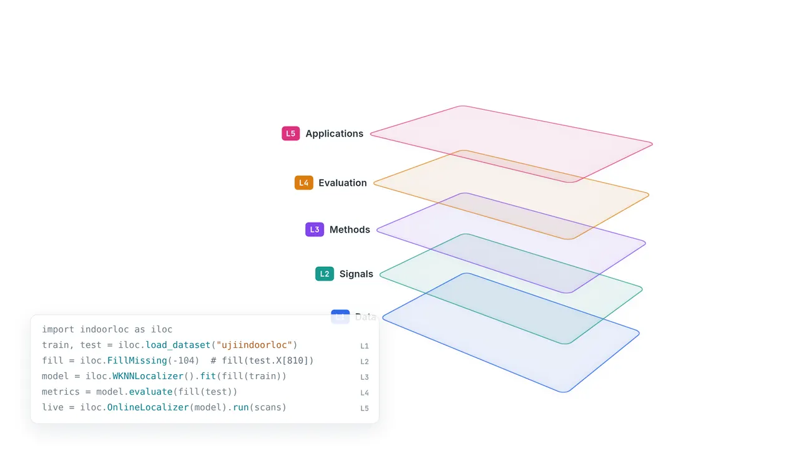
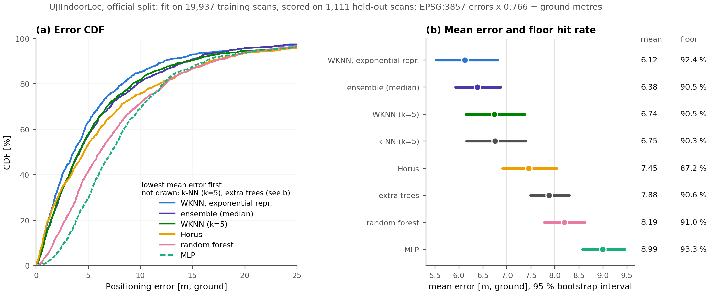
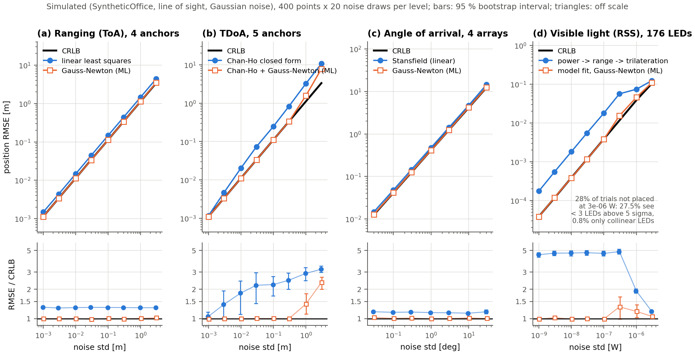
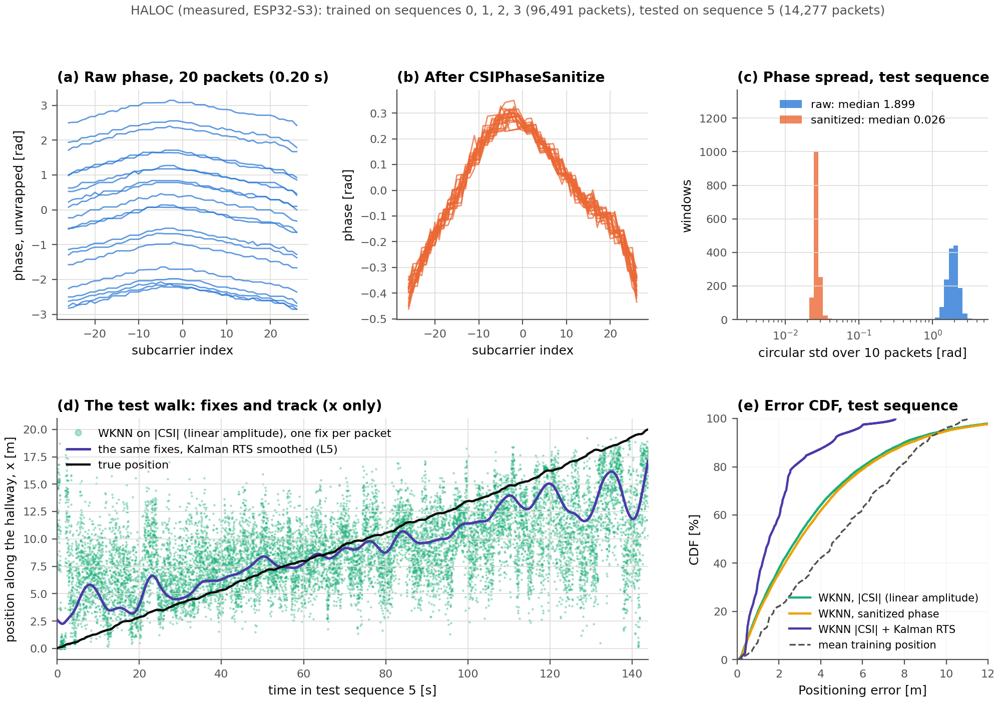
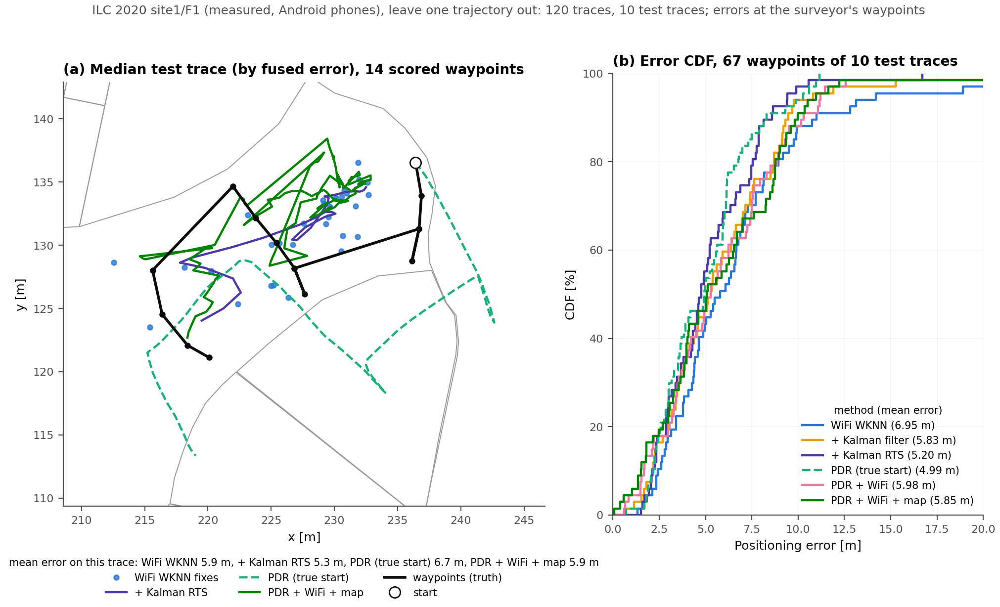
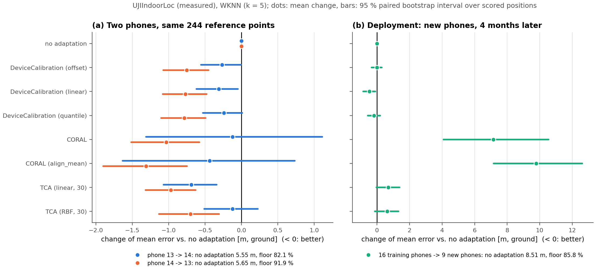
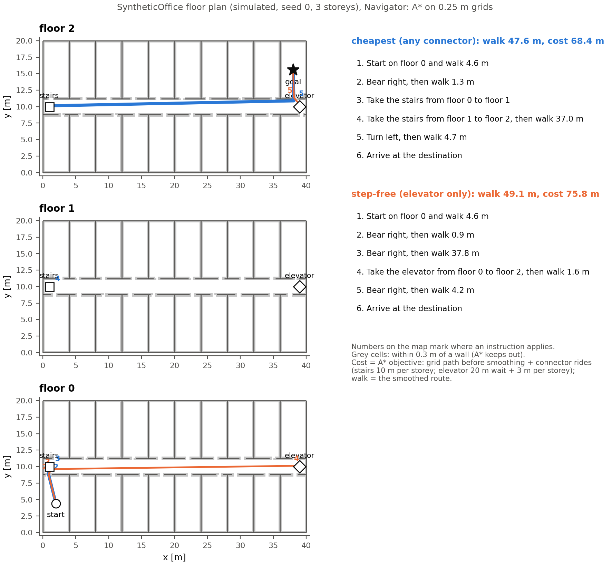

<div align="center">


**IndoorLoc | 室内定位工具库**

*Wireless indoor localization in five layers: datasets, signals, methods, evaluation, applications.*

[](https://github.com/qdtiger/indoorloc/actions/workflows/ci.yml)
[](https://pypi.org/project/indoorloc/)
[](pyproject.toml)
[](https://opensource.org/licenses/Apache-2.0)
[](https://github.com/qdtiger/indoorloc)

[📘 User guide](docs/guide/index.md) |
[🧱 Architecture](#architecture) |
[🛠️ Installation](#installation) |
[🗂️ Layer by layer](#layer-by-layer) |
[📊 Benchmarks](#benchmarks) |
[🖼️ Gallery](#gallery) |
[🔁 Migrating from 0.1](MIGRATION.md)

[English](README.md) | [中文](README_zh.md)

</div>

---

<p align="center">
  <a href="assets/readme/localization.webp"></a>
</p>

```python
import indoorloc as iloc

train, test = iloc.load_dataset("ujiindoorloc")        # L1: download, sha256-check, arrays in physical units
model = iloc.create_model("wknn", preprocess=iloc.FillMissing(-104))   # L2 + L3
print(model.fit(train).evaluate(test))                  # L4
# mean 8.7937  median 5.3546  P90 19.1537  floor 90.46 %  building 99.73 %  (n=1111)
```

## Why IndoorLoc

Indoor-positioning research has a comparability problem: many papers release no code, many
datasets ship without a standard split, and published numbers are hard to compare across
labs. IndoorLoc puts data, signal processing, methods, evaluation and applications behind one
small contract, so that a result is a command anyone can rerun.

- **The whole stack.** 13 measured datasets (WiFi, BLE, CSI, phone IMU), a physics-based
  office simulator and a DeepMIMO v4 adapter; 17 signal transforms; 21 localization methods
  from k-NN to Chan's TDoA, MUSIC, Gaussian processes and deep networks, plus CORAL/TCA domain
  adaptation; 11 evaluation protocols, competition scores and Cramér-Rao bounds; Kalman and
  particle filters, pedestrian dead reckoning, sensor fusion and navigation.
- **Every layer stands alone.** Layers exchange two frozen array containers (`SampleTable`,
  `Prediction`). Use our datasets with your model, our models on your arrays, or our metrics on
  your predictions. Everything is scikit-learn compatible, and numpy is the only hard dependency.
- **Numbers you can trust.** Every file of a measured dataset is sha256-verified. Missing
  readings are NaN, never sentinels. Neighbour ties are broken by index, so results do not
  depend on thread counts. Models save without pickle. Published results live in a separate table with their source and
  check status, and are never mixed with our own runs.
- **Engineered to last.** 687 tests; import-linter contracts that keep the layers apart; a CI
  configuration that runs the tests on numpy alone for Python 3.10–3.14 and with the `full`
  extra on 3.10 and 3.12; documentation snippets that are executed; and a 349-cell benchmark
  matrix, 124 cells of which were rerun in separate processes with identical results.

## Architecture

<p align="center">
  <br>
  <b>Figure</b>: the five layers and what each one ships. Filled: available; outlined in colour:
  available with stated limits; grey: planned. <a href="docs/architecture/figure.py">Generated</a>
  from a table that a test checks against the code.
</p>

```text
L5  apps        tracking, PDR, fusion, streaming, navigation     built on L2-L4
L3  methods     fingerprinting, model-based, deep, transfer      fit(X, y) / localize(X) -> Prediction
L1  datasets    measured datasets and simulators       ┐
L2  signals     transforms and signal functions        ├  independent of each other
L4  evaluation  metrics, protocols, bounds, literature ┘
    core        SampleTable, Prediction, Estimator, persistence (numpy + standard library)
```

L3 and L5 never import L1: data arrives as arrays. `import indoorloc` loads nothing but itself
until you touch a name, and every layer imports without torch, scikit-learn, scipy or pandas.
The rules are in [docs/architecture/CONTRACTS.md](docs/architecture/CONTRACTS.md) and are
enforced by `lint-imports` in CI.

## At a glance

<table align="center">
  <tbody>
    <tr align="center" valign="bottom">
      <td><b>L1 · Datasets (15)</b></td>
      <td><b>L2 · Signals (17)</b></td>
      <td><b>L3 · Methods (21)</b></td>
      <td><b>L4 · Evaluation</b></td>
      <td><b>L5 · Applications</b></td>
    </tr>
    <tr valign="top">
      <td>
        <b>WiFi RSSI</b>
        <ul>
          <li><a href="indoorloc/datasets/ujiindoorloc.py">UJIIndoorLoc</a></li>
          <li><a href="indoorloc/datasets/sodindoorloc.py">SODIndoorLoc</a></li>
          <li><a href="indoorloc/datasets/tampere.py">Tampere</a></li>
          <li><a href="indoorloc/datasets/tuji1.py">TUJI1</a></li>
          <li><a href="indoorloc/datasets/longtermwifi.py">LongTermWiFi</a></li>
          <li><a href="indoorloc/datasets/wlanrssi.py">WLANRSSI</a></li>
        </ul>
        <b>BLE RSSI</b>
        <ul>
          <li><a href="indoorloc/datasets/ble_indoor.py">BBIL</a></li>
          <li><a href="indoorloc/datasets/ibeacon_rssi.py">UJI iBeacon</a></li>
          <li><a href="indoorloc/datasets/ble_rssi_uci.py">BLE RSSI (UCI)</a></li>
        </ul>
        <b>WiFi CSI</b>
        <ul>
          <li><a href="indoorloc/datasets/haloc.py">HALOC</a></li>
          <li><a href="indoorloc/datasets/hwild.py">H-WILD</a></li>
          <li><a href="indoorloc/datasets/csi_fingerprint.py">CSI fingerprints</a></li>
        </ul>
        <b>Phone traces</b>
        <ul>
          <li><a href="indoorloc/datasets/ilc2020.py">ILC 2020</a> (IMU, WiFi, BLE, floor plans)</li>
        </ul>
        <b>Simulated</b>
        <ul>
          <li><a href="indoorloc/datasets/simulated/office.py">SyntheticOffice</a>: RSSI, ranges, TDoA, AoA, CSI, IMU, magnetic, VLC</li>
          <li><a href="indoorloc/datasets/simulated/deepmimo.py">DeepMIMO v4</a> adapter</li>
        </ul>
      </td>
      <td>
        <b>RSSI</b>
        <ul>
          <li>FillMissing · RSSINormalize</li>
          <li>Positive / Exponential / Powed representations</li>
          <li>APFilter · APSelect</li>
          <li>DeviceCalibration</li>
          <li>APDropout · GaussianNoise</li>
        </ul>
        <b>CSI</b>
        <ul>
          <li>CSIAmplitude · CSIPhaseSanitize</li>
          <li>SubcarrierSelect · HampelFilter</li>
        </ul>
        <b>Other modalities</b>
        <ul>
          <li><a href="indoorloc/signals/ranging.py">ranging</a> (RTT, UWB, ultrasound)</li>
          <li><a href="indoorloc/signals/imu.py">IMU</a></li>
          <li><a href="indoorloc/signals/magnetic.py">magnetic</a>: MagneticFeatures, calibration</li>
          <li><a href="indoorloc/signals/vlc.py">visible light</a> (Lambertian)</li>
        </ul>
        <b>Composition</b>
        <ul>
          <li>Compose, and <code>preprocess=</code> on any model</li>
        </ul>
      </td>
      <td>
        <b>Fingerprinting</b>
        <ul>
          <li><a href="indoorloc/methods/neighbors.py">k-NN · WKNN</a></li>
          <li><a href="indoorloc/methods/probabilistic.py">Horus</a></li>
          <li><a href="indoorloc/methods/gaussian_process.py">GP radio map</a></li>
          <li><a href="indoorloc/methods/sklearn_wrap.py">SVM · RF · extra trees · GBDT</a></li>
          <li><a href="indoorloc/methods/ensemble.py">ensemble · stacking</a></li>
          <li><a href="indoorloc/methods/hierarchical.py">hierarchical (building → floor → position)</a></li>
        </ul>
        <b>Model-based</b>
        <ul>
          <li><a href="indoorloc/methods/geometric.py">trilateration · Chan TDoA · weighted centroid</a></li>
          <li><a href="indoorloc/methods/pathloss.py">path-loss ML</a></li>
          <li><a href="indoorloc/methods/aoa.py">MUSIC AoA</a></li>
          <li><a href="indoorloc/methods/vlc.py">Lambertian VLC</a></li>
        </ul>
        <b>Sequence</b>
        <ul>
          <li><a href="indoorloc/methods/magnetic.py">magnetic DTW</a></li>
        </ul>
        <b>Deep</b>
        <ul>
          <li><a href="indoorloc/methods/deep/">MLP · CNN1D · timm backbones</a></li>
        </ul>
        <b>Transfer</b>
        <ul>
          <li><a href="indoorloc/methods/transfer.py">CORAL · TCA · skada adapter</a></li>
        </ul>
      </td>
      <td>
        <b>Metrics</b>
        <ul>
          <li>error statistics, CDF, bootstrap CI</li>
          <li>floor / building accuracy</li>
          <li>IPIN and EvAAL-ETRI scores</li>
        </ul>
        <b>Protocols (11)</b>
        <ul>
          <li>official · random · k-fold</li>
          <li>cross-device · cross-time</li>
          <li>leave-one-user / trajectory / building out</li>
        </ul>
        <b>Bounds</b>
        <ul>
          <li>CRLB for ToA, TDoA, AoA, RSS · GDOP</li>
        </ul>
        <b>Literature</b>
        <ul>
          <li>published numbers with source and check status</li>
        </ul>
        <b>Tools</b>
        <ul>
          <li><code>indoorloc benchmark</code> CLI · reports · plots</li>
        </ul>
      </td>
      <td>
        <b>Tracking</b>
        <ul>
          <li><a href="indoorloc/apps/tracking.py">Kalman · RTS smoother · EKF on ranges</a></li>
          <li><a href="indoorloc/apps/particle.py">particle filter with floor maps</a></li>
        </ul>
        <b>Pedestrian dead reckoning</b>
        <ul>
          <li><a href="indoorloc/apps/pdr.py">step detection · Weinberg / Kim step length · heading</a></li>
        </ul>
        <b>Fusion</b>
        <ul>
          <li><a href="indoorloc/apps/fusion.py">PDR + any L3 localizer</a></li>
        </ul>
        <b>Deployment</b>
        <ul>
          <li><a href="indoorloc/apps/streaming.py">online localizer (streams)</a></li>
          <li><a href="indoorloc/apps/navigation.py">A* navigation, multi-floor, instructions</a></li>
          <li><a href="indoorloc/apps/maps.py">floor maps</a></li>
        </ul>
      </td>
    </tr>
  </tbody>
</table>

## Installation

IndoorLoc needs Python 3.10 or newer; numpy is its only required dependency. Until 0.2.0 is on
PyPI, install from a clone:

```bash
git clone https://github.com/qdtiger/indoorloc.git && cd indoorloc
pip install -e .              # every layer on numpy alone: k-NN, Horus, GP, model-based methods, trackers
pip install -e ".[sklearn]"   # + SVM, random forest, extra trees, gradient boosting
pip install -e ".[deep]"      # + MLP / CNN1D / timm localizers (torch)
pip install -e ".[full]"      # all of the above + plots, CSI .mat/.h5 readers, pandas (not skada, DeepMIMO)
```

The [installation page](docs/installation.md) lists every extra.

## Layer by layer

**L1 · Datasets.** One call downloads, verifies and parses a dataset into a `SampleTable` of
numpy arrays in physical units: dBm with NaN for "not heard", complex CSI, positions in the
dataset's own frame and units, with groups for grouped splits.

```python
train, test = iloc.load_dataset("ujiindoorloc")
train.X.shape, train.meta["crs"], sorted(train.groups)
# (19937, 520) EPSG:3857 ['device', 'relative_position', 'space', 'time', 'user']
imu = iloc.load_dataset("ilc2020", site="site1", floor="F1", modality="imu")   # 50 Hz phone IMU + floor plan
csi = iloc.load_dataset("haloc", split="test")                                 # complex64 (14277, 1, 1, 52)
office = iloc.load_dataset("synthetic_office", modality="ranges")              # simulated, no download
```

**L2 · Signals.** Transforms follow the scikit-learn transformer contract and accept one scan, a
batch or a `SampleTable`.

```python
rssi = iloc.Compose([iloc.APFilter(-95), iloc.ExponentialRepresentation()])  # Torres-Sospedra et al. 2015
amplitude = iloc.CSIAmplitude()(csi)                    # |H|, modality "csi_amp"
clean = iloc.CSIPhaseSanitize()(csi)                    # linear phase offset removed across subcarriers
```

**L3 · Methods.** Every method has the same `fit` / `localize` / `evaluate` interface, a registry
name, and pickle-free `save` / `load_model`.

```python
horus = iloc.create_model("horus").fit(train)           # NaN-aware probabilistic fingerprinting
horus.evaluate(test).mean_error                         # 7.994
tr, te = office
geo = iloc.create_model("trilateration", anchors=tr.meta["anchors"]).fit(tr)
print(geo.evaluate(te))                                  # simulated UWB ranges with NLOS bias
# mean 0.6035  median 0.4921  P90 1.2515  floor n/a  building n/a  (n=200)
horus.save("horus_uji"); horus = iloc.load_model("horus_uji")   # config.json + arrays.npz
```

**L4 · Evaluation.** Metrics are functions of plain arrays; protocols return index arrays built
from the table's groups.

```python
from indoorloc.evaluation import get_protocol, ipin_score
pred = model.localize(test)
ipin_score(test, pred)                 # 12.201: P75 of (error + 15 m per wrong floor + 50 m per wrong building)
model.evaluate(test).cdf([1, 5, 10])   # [0.096 0.476 0.736]: share of scans within 1, 5, 10 m
folds = get_protocol("cross-device").folds(train, random_state=0)   # one fold per phone (16)
```

```bash
indoorloc benchmark --dataset ujiindoorloc --method knn --method wknn --method horus --out uji.json
indoorloc literature ujiindoorloc     # published numbers, each with its source and check status
```

**L5 · Applications.** Trackers, dead reckoning and fusion take any L3 output; navigation plans
routes on the dataset's floor plan.

```python
rssi_train, _ = iloc.load_dataset("synthetic_office")                 # simulated WiFi radio map
walks = iloc.load_dataset("synthetic_office", split="trajectory")      # simulated walks, 1 scan/s
walk = walks[walks.groups["trajectory"] == 0]
fixes = iloc.create_model("wknn", preprocess=iloc.FillMissing(-104)).fit(rssi_train).localize(walk)
smooth = iloc.KalmanTracker().smooth(fixes, t=walk.groups["time"])   # mean error 2.97 m -> 2.11 m
nav = iloc.Navigator().fit(iloc.FloorMap.from_dict(walk.meta["floor_plan"]))
nav.route((2.0, 2.0), (36.0, 17.0)).instructions[1].text             # 'Turn right, then walk 33.5 m'
```

The [user guide](docs/guide/index.md) walks through each layer with executed examples.

## Gallery

Every figure is produced by a script in [`examples/`](examples) and prints its numbers.
Measured data and simulated data are labelled on each figure.

| | |
| :---: | :---: |
| <br>**Fingerprinting on UJIIndoorLoc** (measured). Eight methods, one protocol, 95 % bootstrap intervals. [`01`](examples/01_fingerprinting_benchmark.py) | <br>**Model-based estimators against the Cramér-Rao bound** (simulated). Maximum-likelihood ToA, TDoA, AoA and VLC estimators reach the bound up to moderate noise. [`02`](examples/02_model_based_vs_crlb.py) |
| <br>**CSI on HALOC** (measured). Raw vs sanitized phase; amplitude fingerprints; Kalman smoothing along the walk. [`03`](examples/03_csi_pipeline.py) | <br>**Tracking and fusion on ILC 2020 phone traces** (measured). WiFi fixes, Kalman/RTS, PDR, and a PDR + WiFi particle filter on the floor plan. [`04`](examples/04_tracking_and_fusion.py) |
| <br>**Cross-device adaptation on UJIIndoorLoc** (measured), including the cases where it does not help. [`05`](examples/05_domain_adaptation.py) | <br>**Multi-floor A* navigation** (simulated plan): cheapest vs step-free route with turn-by-turn instructions. [`06`](examples/06_navigation.py) |

## Benchmarks

[docs/benchmarks.md](docs/benchmarks.md) ([中文](docs/benchmarks_zh.md)) holds 349 benchmark
cells on 12 real datasets, each run in its own process through the public command line
(`benchmarks/labels.py` for WLANRSSI's room labels) on sha256-verified files, with seeds,
library digest, wall time and peak memory recorded. Reruns of 124 cells in separate processes
were identical. A selection (pooled mean error; *baseline* predicts the mean training
position):

| Dataset | Protocol | Units | Baseline | WKNN (k=5) | Best in the table |
| :--- | :--- | ---: | ---: | ---: | :--- |
| UJIIndoorLoc | official | m (EPSG:3857) | 143.33 | 8.794 | WKNN, exponential representation: 7.988 |
| SODIndoorLoc (3 buildings) | official | m | 636.08 | 3.350 | Horus on raw RSSI (NaN = not heard): 2.852 |
| Tampere | official | m | 33.21 | 9.300 | extra trees: 8.081 |
| TUJI1 | official | m | 9.261 | 2.733 | Horus on raw RSSI: 2.126 |
| LongTermWiFi (25 months) | official | m | 5.004 | 2.288 | median ensemble (WKNN, RF, Horus): 1.950 |
| UJI iBeacon | official | m | 8.699 | 3.510 | median ensemble: 3.271 |
| BBIL office (BLE) | official | m | 7.416 | 3.517 | MLP: 3.235 |
| HALOC (CSI) | official | m | 4.897 | 3.669 | MLP on \|CSI\|: 2.964 |
| H-WILD conference (CSI) | leave one user out | m | 2.408 | 1.056 | MLP on \|CSI\|: 0.806 |
| WLANRSSI | stratified 5-fold | % rooms | 25.00 % | 98.40 % | MLP: 98.60 % |

Published numbers appear only in their own tables, with their source and check status: they were
obtained with other code, preprocessing and often other protocols. The
[cross-checks](docs/benchmarks.md#cross-checks-against-known-values) recompute five known values
with plain numpy, outside the library's methods, including the TUJI1 paper's 1-NN baseline
(3.34 m; ours 3.343 m).

On the ILC 2020 phone traces (site1/F1, 10 held-out traces, 67 waypoints), WiFi WKNN averages
6.95 m, the offline Kalman RTS smoother 5.20 m and the causal PDR + WiFi particle filter with the
floor plan 5.85 m. Both improve on the WiFi fixes by more than the trace-to-trace variation (95 %
bootstrap over traces: −1.75 m [−3.47, −0.67] and −1.10 m [−2.32, −0.21]); ten traces are too
few to rank the two against each other ([`04`](examples/04_tracking_and_fusion.py)).

## Reproducibility

- `python -m examples.readme_demo` replays the animation's recorded case; `--rebuild` refits it
  from the original files and must give the same numbers bit for bit.
- `python -m benchmarks.run` reruns the benchmark matrix; `python -m benchmarks.crosscheck`
  recomputes its reference cells with plain numpy from the loaders' arrays.
- `python docs/catalog.py --snippets` runs the Python blocks of the user guide and checks what
  they print.
- 0.1 results differ from 0.2 (UJIIndoorLoc k-NN 8.8891 → 8.8084 m): 0.1 ordered equally
  distant neighbours differently for each BLAS thread count. [MIGRATION.md](MIGRATION.md)
  reproduces both.

## Documentation

- [User guide](docs/guide/index.md) · [用户指南](docs/zh/index.md): datasets, signals, methods,
  evaluation, applications, command line, extending.
- [Developer contracts](docs/architecture/CONTRACTS.md): layer rules and data layouts.
- [Benchmarks](docs/benchmarks.md) · [Migrating from 0.1](MIGRATION.md) · [Changelog](CHANGELOG.md)

## What's new

- **2026-09-29 · 0.2.0.dev0.** A rewrite in five array-first layers: 13 measured datasets, a
  simulator and a DeepMIMO adapter, 21 methods, 11 protocols, bounds and literature tables, a full application layer,
  a 349-cell benchmark matrix and a bilingual user guide. See the [changelog](CHANGELOG.md).
- **2025-12-16** · 0.1.3 on [PyPI](https://pypi.org/project/indoorloc/). **2025-11-26** · first public release (0.1.0).

## Roadmap

- Ray-traced data: Sionna RT scenes and digital-twin pairs (a DeepMIMO v4 adapter ships, not yet
  validated on a published scenario).
- Self-supervised pretraining and channel charting in L3.
- Released model weights for every benchmark row.

## Contributing

Pull requests are welcome, above all new datasets and methods. [Extending IndoorLoc](docs/guide/extending.md)
explains what a contribution needs: a class, a registry entry, a References section and a test
against a known result.

## Citation

```bibtex
@software{indoorloc,
  title  = {IndoorLoc: Wireless Indoor Localization in Five Layers},
  year   = {2026},
  url    = {https://github.com/qdtiger/indoorloc},
  note   = {Version 0.2}
}
```

Please also cite the datasets and methods you use; each loader and method lists its references.

## License

Apache License 2.0. Datasets keep their own licenses, listed in each loader and by
`indoorloc info <dataset>`.

## Acknowledgements

The dataset authors who publish their data openly; [scikit-learn](https://scikit-learn.org/) for
the estimator API this library follows; [import-linter](https://github.com/seddonym/import-linter)
for the layer contracts; [timm](https://github.com/huggingface/pytorch-image-models) and
[SKADA](https://github.com/scikit-adaptation/skada) for optional backends.
