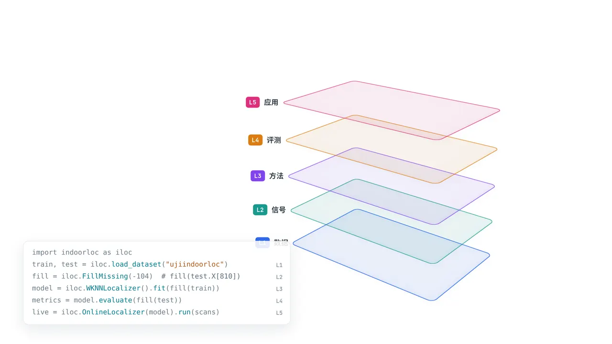
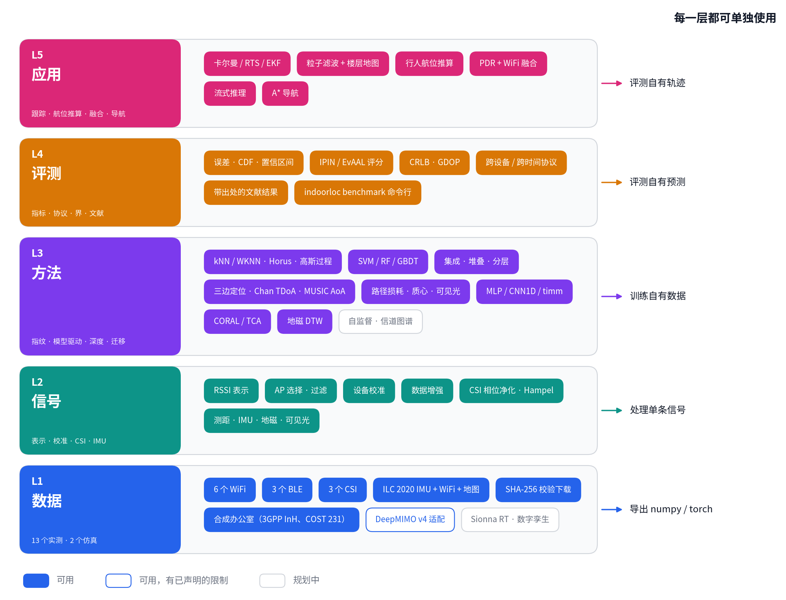

<div align="center">


**IndoorLoc | 室内定位工具库**

*无线室内定位的五层工具库：数据集、信号、方法、评测、应用。*

[](https://github.com/qdtiger/indoorloc/actions/workflows/ci.yml)
[](https://pypi.org/project/indoorloc/)
[](pyproject.toml)
[](https://opensource.org/licenses/Apache-2.0)
[](https://github.com/qdtiger/indoorloc)

[📘 用户指南](docs/zh/index.md) |
[🧱 架构](#架构) |
[🛠️ 安装](#安装) |
[🗂️ 逐层使用](#逐层使用) |
[📊 基准](#基准) |
[🖼️ 图集](#图集) |
[🔁 从 0.1 迁移](MIGRATION.md)

[English](README.md) | [中文](README_zh.md)

</div>

---

<p align="center">
  <a href="assets/readme/localization-zh.webp"></a>
</p>

```python
import indoorloc as iloc

train, test = iloc.load_dataset("ujiindoorloc")        # L1：下载、SHA-256 校验、物理单位的数组
model = iloc.create_model("wknn", preprocess=iloc.FillMissing(-104))   # L2 + L3
print(model.fit(train).evaluate(test))                  # L4
# mean 8.7937  median 5.3546  P90 19.1537  floor 90.46 %  building 99.73 %  (n=1111)
```

## 为什么是 IndoorLoc

室内定位研究的结果难以横向比较：不少论文没有公开代码，许多数据集没有标准切分，不同实验室发表的数字也很难对照。IndoorLoc 用一套精简的约定把数据、信号处理、方法、评测和应用串起来，让每个结果都能由任何人用一条命令重跑出来。

- **覆盖全链路。** 13 个实测数据集（WiFi、BLE、CSI、手机 IMU）、一个基于物理模型的办公楼仿真器和一个 DeepMIMO v4 适配器；17 个信号变换；21 种定位方法，从 k-NN 到 Chan TDoA、MUSIC、高斯过程和深度网络，另有 CORAL/TCA 域适应；11 个评测协议、竞赛评分与 Cramér-Rao 界；卡尔曼滤波与粒子滤波、行人航位推算、传感器融合和导航。
- **每一层都可单独使用。** 层与层之间只交换两个冻结的数组容器（`SampleTable`、`Prediction`）。可以用我们的数据集跑你的模型，用我们的模型跑你的数组，或用我们的指标评测你的预测。全部兼容 scikit-learn 接口，唯一的必需依赖是 numpy。
- **数字可信。** 实测数据集的每个文件都做 SHA-256 校验；缺测一律为 NaN，不用哨兵值；距离相同的近邻按训练样本序号取舍，结果与线程数无关；模型保存不用 pickle。文献结果单独成表，写明出处与核对状态，从不与本库的运行结果混在一起。
- **经得起长期维护。** 687 个测试；用 import-linter 契约隔离各层；CI 配置在 Python 3.10–3.14 上只装 numpy 跑测试，并在 3.10 和 3.12 上装 `full` extra 再跑一遍；文档中的代码块会被实际执行；基准矩阵共 349 个单元，其中 124 个在独立进程中重跑，结果完全一致。

## 架构

<p align="center">
  <br>
  <b>图</b>：五层架构及每层已交付的内容。实心：可用；彩色描边：可用但有已声明的限制；灰色：规划中。由 <a href="docs/architecture/figure.py">脚本生成</a>，其数据表由测试对照代码检查。
</p>

```text
L5  apps        跟踪、PDR、融合、流式推理、导航                  建在 L2-L4 之上
L3  methods     指纹、模型驱动、深度、迁移                        fit(X, y) / localize(X) -> Prediction
L1  datasets    实测数据集与仿真器                   ┐
L2  signals     信号变换与信号函数                   ├  彼此独立
L4  evaluation  指标、协议、界、文献                  ┘
    core        SampleTable、Prediction、Estimator、持久化（numpy + 标准库）
```

L3 和 L5 从不导入 L1：数据以数组形式传入。`import indoorloc` 在访问具体名字之前不加载任何东西，每一层都能在没有 torch、scikit-learn、scipy、pandas 的环境下导入。规则写在 [docs/architecture/CONTRACTS.md](docs/architecture/CONTRACTS.md)，由 CI 中的 `lint-imports` 强制执行。

## 一览

<table align="center">
  <tbody>
    <tr align="center" valign="bottom">
      <td><b>L1 · 数据集 (15)</b></td>
      <td><b>L2 · 信号 (17)</b></td>
      <td><b>L3 · 方法 (21)</b></td>
      <td><b>L4 · 评测</b></td>
      <td><b>L5 · 应用</b></td>
    </tr>
    <tr valign="top">
      <td>
        <b>WiFi RSSI</b>
        <ul>
          <li><a href="indoorloc/datasets/ujiindoorloc.py">UJIIndoorLoc</a></li>
          <li><a href="indoorloc/datasets/sodindoorloc.py">SODIndoorLoc</a></li>
          <li><a href="indoorloc/datasets/tampere.py">Tampere</a></li>
          <li><a href="indoorloc/datasets/tuji1.py">TUJI1</a></li>
          <li><a href="indoorloc/datasets/longtermwifi.py">LongTermWiFi</a></li>
          <li><a href="indoorloc/datasets/wlanrssi.py">WLANRSSI</a></li>
        </ul>
        <b>BLE RSSI</b>
        <ul>
          <li><a href="indoorloc/datasets/ble_indoor.py">BBIL</a></li>
          <li><a href="indoorloc/datasets/ibeacon_rssi.py">UJI iBeacon</a></li>
          <li><a href="indoorloc/datasets/ble_rssi_uci.py">BLE RSSI (UCI)</a></li>
        </ul>
        <b>WiFi CSI</b>
        <ul>
          <li><a href="indoorloc/datasets/haloc.py">HALOC</a></li>
          <li><a href="indoorloc/datasets/hwild.py">H-WILD</a></li>
          <li><a href="indoorloc/datasets/csi_fingerprint.py">CSI 指纹</a></li>
        </ul>
        <b>手机轨迹</b>
        <ul>
          <li><a href="indoorloc/datasets/ilc2020.py">ILC 2020</a>（IMU、WiFi、BLE、楼层地图）</li>
        </ul>
        <b>仿真</b>
        <ul>
          <li><a href="indoorloc/datasets/simulated/office.py">SyntheticOffice</a>：RSSI、测距、TDoA、AoA、CSI、IMU、地磁、可见光</li>
          <li><a href="indoorloc/datasets/simulated/deepmimo.py">DeepMIMO v4</a> 适配</li>
        </ul>
      </td>
      <td>
        <b>RSSI</b>
        <ul>
          <li>FillMissing · RSSINormalize</li>
          <li>Positive / Exponential / Powed 表示</li>
          <li>APFilter · APSelect</li>
          <li>DeviceCalibration 设备校准</li>
          <li>APDropout · GaussianNoise 增强</li>
        </ul>
        <b>CSI</b>
        <ul>
          <li>CSIAmplitude · CSIPhaseSanitize</li>
          <li>SubcarrierSelect · HampelFilter</li>
        </ul>
        <b>其他模态</b>
        <ul>
          <li><a href="indoorloc/signals/ranging.py">测距</a>（RTT、UWB、超声）</li>
          <li><a href="indoorloc/signals/imu.py">IMU</a></li>
          <li><a href="indoorloc/signals/magnetic.py">地磁</a>：MagneticFeatures、磁力计校准</li>
          <li><a href="indoorloc/signals/vlc.py">可见光</a>（朗伯模型）</li>
        </ul>
        <b>组合</b>
        <ul>
          <li>Compose，以及任意模型的 <code>preprocess=</code></li>
        </ul>
      </td>
      <td>
        <b>指纹</b>
        <ul>
          <li><a href="indoorloc/methods/neighbors.py">k-NN · WKNN</a></li>
          <li><a href="indoorloc/methods/probabilistic.py">Horus</a></li>
          <li><a href="indoorloc/methods/gaussian_process.py">高斯过程无线电地图</a></li>
          <li><a href="indoorloc/methods/sklearn_wrap.py">SVM · 随机森林 · 极端随机树 · GBDT</a></li>
          <li><a href="indoorloc/methods/ensemble.py">集成 · 堆叠</a></li>
          <li><a href="indoorloc/methods/hierarchical.py">分层（建筑 → 楼层 → 位置）</a></li>
        </ul>
        <b>模型驱动</b>
        <ul>
          <li><a href="indoorloc/methods/geometric.py">三边定位 · Chan TDoA · 加权质心</a></li>
          <li><a href="indoorloc/methods/pathloss.py">路径损耗最大似然</a></li>
          <li><a href="indoorloc/methods/aoa.py">MUSIC 到达角</a></li>
          <li><a href="indoorloc/methods/vlc.py">朗伯可见光定位</a></li>
        </ul>
        <b>序列</b>
        <ul>
          <li><a href="indoorloc/methods/magnetic.py">地磁 DTW</a></li>
        </ul>
        <b>深度</b>
        <ul>
          <li><a href="indoorloc/methods/deep/">MLP · CNN1D · timm 骨干</a></li>
        </ul>
        <b>迁移</b>
        <ul>
          <li><a href="indoorloc/methods/transfer.py">CORAL · TCA · skada 适配器</a></li>
        </ul>
      </td>
      <td>
        <b>指标</b>
        <ul>
          <li>误差统计、CDF、bootstrap 置信区间</li>
          <li>楼层 / 建筑准确率</li>
          <li>IPIN 与 EvAAL-ETRI 评分</li>
        </ul>
        <b>协议 (11)</b>
        <ul>
          <li>官方 · 随机 · k 折</li>
          <li>跨设备 · 跨时间</li>
          <li>留一用户 / 轨迹 / 建筑</li>
        </ul>
        <b>界</b>
        <ul>
          <li>ToA、TDoA、AoA、RSS 的 CRLB · GDOP</li>
        </ul>
        <b>文献</b>
        <ul>
          <li>已发表数字，附出处与核对状态</li>
        </ul>
        <b>工具</b>
        <ul>
          <li><code>indoorloc benchmark</code> 命令行 · 报告 · 绘图</li>
        </ul>
      </td>
      <td>
        <b>跟踪</b>
        <ul>
          <li><a href="indoorloc/apps/tracking.py">卡尔曼 · RTS 平滑 · 测距 EKF</a></li>
          <li><a href="indoorloc/apps/particle.py">带楼层地图的粒子滤波</a></li>
        </ul>
        <b>行人航位推算</b>
        <ul>
          <li><a href="indoorloc/apps/pdr.py">步伐检测 · Weinberg / Kim 步长 · 航向</a></li>
        </ul>
        <b>融合</b>
        <ul>
          <li><a href="indoorloc/apps/fusion.py">PDR + 任意 L3 定位器</a></li>
        </ul>
        <b>部署</b>
        <ul>
          <li><a href="indoorloc/apps/streaming.py">在线定位（数据流）</a></li>
          <li><a href="indoorloc/apps/navigation.py">A* 导航，跨楼层，逐段提示</a></li>
          <li><a href="indoorloc/apps/maps.py">楼层地图</a></li>
        </ul>
      </td>
    </tr>
  </tbody>
</table>

## 安装

需要 Python 3.10 或更新版本，唯一的必需依赖是 numpy。0.2.0 发布到 PyPI 之前，从源码安装：

```bash
git clone https://github.com/qdtiger/indoorloc.git && cd indoorloc
pip install -e .              # 只装 numpy 即可使用每一层：k-NN、Horus、高斯过程、模型驱动方法、跟踪器
pip install -e ".[sklearn]"   # + SVM、随机森林、极端随机树、梯度提升
pip install -e ".[deep]"      # + MLP / CNN1D / timm 定位器（torch）
pip install -e ".[full]"      # 以上全部，另加绘图、CSI .mat/.h5 读取和 pandas（不含 skada、DeepMIMO）
```

全部可选依赖见[安装说明](docs/installation_zh.md)。

## 逐层使用

**L1 · 数据集。** 一次调用完成下载、校验和解析，得到以物理单位存储的 `SampleTable`：RSSI 为 dBm（NaN 表示未检测到），CSI 为复数，位置保留数据集原始的坐标系与单位，并附带用于分组切分的 `groups`。

```python
train, test = iloc.load_dataset("ujiindoorloc")
train.X.shape, train.meta["crs"], sorted(train.groups)
# (19937, 520) EPSG:3857 ['device', 'relative_position', 'space', 'time', 'user']
imu = iloc.load_dataset("ilc2020", site="site1", floor="F1", modality="imu")   # 50 Hz 手机 IMU + 楼层地图
csi = iloc.load_dataset("haloc", split="test")                                 # complex64 (14277, 1, 1, 52)
office = iloc.load_dataset("synthetic_office", modality="ranges")              # 仿真，无需下载
```

**L2 · 信号。** 变换遵循 scikit-learn 的 transformer 约定，可作用于单条扫描、一批扫描或 `SampleTable`。

```python
rssi = iloc.Compose([iloc.APFilter(-95), iloc.ExponentialRepresentation()])  # Torres-Sospedra 等 2015
amplitude = iloc.CSIAmplitude()(csi)                    # |H|，模态变为 "csi_amp"
clean = iloc.CSIPhaseSanitize()(csi)                    # 去除跨子载波的线性相位偏移
```

**L3 · 方法。** 所有方法都有相同的 `fit` / `localize` / `evaluate` 接口、一个注册名，以及不依赖 pickle 的 `save` / `load_model`。

```python
horus = iloc.create_model("horus").fit(train)           # 直接处理 NaN 的概率指纹方法
horus.evaluate(test).mean_error                         # 7.994
tr, te = office
geo = iloc.create_model("trilateration", anchors=tr.meta["anchors"]).fit(tr)
print(geo.evaluate(te))                                  # 仿真 UWB 测距，含非视距偏差
# mean 0.6035  median 0.4921  P90 1.2515  floor n/a  building n/a  (n=200)
horus.save("horus_uji"); horus = iloc.load_model("horus_uji")   # config.json + arrays.npz
```

**L4 · 评测。** 指标是作用于普通数组的函数；协议根据表中的分组返回下标数组。

```python
from indoorloc.evaluation import get_protocol, ipin_score
pred = model.localize(test)
ipin_score(test, pred)                 # 12.201：（误差 + 每错一层 15 m + 错建筑 50 m）的 P75
model.evaluate(test).cdf([1, 5, 10])   # [0.096 0.476 0.736]：误差在 1、5、10 m 以内的比例
folds = get_protocol("cross-device").folds(train, random_state=0)   # 每部手机一折（16 折）
```

```bash
indoorloc benchmark --dataset ujiindoorloc --method knn --method wknn --method horus --out uji.json
indoorloc literature ujiindoorloc     # 已发表数字，逐条附出处与核对状态
```

**L5 · 应用。** 跟踪、航位推算与融合可接收任意 L3 的输出；导航在数据集自带的楼层地图上规划路线。

```python
rssi_train, _ = iloc.load_dataset("synthetic_office")                 # 仿真 WiFi 无线电地图
walks = iloc.load_dataset("synthetic_office", split="trajectory")      # 仿真行走，每秒一次扫描
walk = walks[walks.groups["trajectory"] == 0]
fixes = iloc.create_model("wknn", preprocess=iloc.FillMissing(-104)).fit(rssi_train).localize(walk)
smooth = iloc.KalmanTracker().smooth(fixes, t=walk.groups["time"])   # 平均误差 2.97 m -> 2.11 m
nav = iloc.Navigator().fit(iloc.FloorMap.from_dict(walk.meta["floor_plan"]))
nav.route((2.0, 2.0), (36.0, 17.0)).instructions[1].text             # 'Turn right, then walk 33.5 m'
```

[用户指南](docs/zh/index.md)逐层讲解，其中的代码均实际运行过。

## 图集

每张图都由 [`examples/`](examples) 中的脚本生成，并打印对应数字。图中标明实测数据与仿真数据。

| | |
| :---: | :---: |
| <br>**UJIIndoorLoc 上的指纹定位**（实测）。八种方法、同一协议、95% bootstrap 区间。[`01`](examples/01_fingerprinting_benchmark.py) | <br>**模型驱动方法与 Cramér-Rao 界**（仿真）。在低到中等噪声下，ToA、TDoA、AoA、可见光的最大似然估计达到下界。[`02`](examples/02_model_based_vs_crlb.py) |
| <br>**HALOC 上的 CSI**（实测）。原始相位与校正后的相位、幅度指纹、沿行走路径的卡尔曼平滑。[`03`](examples/03_csi_pipeline.py) | <br>**ILC 2020 手机轨迹上的跟踪与融合**（实测）。WiFi 定位点、卡尔曼/RTS、PDR，以及楼层地图上的 PDR + WiFi 粒子滤波。[`04`](examples/04_tracking_and_fusion.py) |
| <br>**UJIIndoorLoc 上的跨设备域适应**（实测），也列出适应无效的情形。[`05`](examples/05_domain_adaptation.py) | <br>**跨楼层 A* 导航**（仿真平面图）：最低代价路线与无台阶路线，附逐段提示。[`06`](examples/06_navigation.py) |

## 基准

[docs/benchmarks_zh.md](docs/benchmarks_zh.md)（[English](docs/benchmarks.md)）收录 12 个实测数据集上的 349 个实验单元。每个单元都在独立进程中通过公开命令行（WLANRSSI 的房间标签用 `benchmarks/labels.py`）在校验过的文件上运行，记录种子、库摘要、耗时与峰值内存；其中 124 个单元在另一个进程中重跑过一次，结果完全一致。部分结果（合并后的平均误差；*基线* 对每个查询都预测训练位置均值）：

| 数据集 | 协议 | 单位 | 基线 | WKNN (k=5) | 表中最佳 |
| :--- | :--- | ---: | ---: | ---: | :--- |
| UJIIndoorLoc | 官方 | m (EPSG:3857) | 143.33 | 8.794 | WKNN，指数表示：7.988 |
| SODIndoorLoc（3 栋楼） | 官方 | m | 636.08 | 3.350 | Horus（原始 RSSI，NaN 表示未听到）：2.852 |
| Tampere | 官方 | m | 33.21 | 9.300 | 极端随机树：8.081 |
| TUJI1 | 官方 | m | 9.261 | 2.733 | Horus（原始 RSSI）：2.126 |
| LongTermWiFi（25 个月） | 官方 | m | 5.004 | 2.288 | 中位数集成（WKNN、RF、Horus）：1.950 |
| UJI iBeacon | 官方 | m | 8.699 | 3.510 | 中位数集成：3.271 |
| BBIL 办公室（BLE） | 官方 | m | 7.416 | 3.517 | MLP：3.235 |
| HALOC（CSI） | 官方 | m | 4.897 | 3.669 | MLP（\|CSI\|）：2.964 |
| H-WILD 会议室（CSI） | 留一用户 | m | 2.408 | 1.056 | MLP（\|CSI\|）：0.806 |
| WLANRSSI | 分层 5 折 | 房间准确率 | 25.00 % | 98.40 % | MLP：98.60 % |

已发表的数字只出现在单独的表中，附出处与核对状态：它们来自别的代码、预处理，协议也往往不同。[交叉核对](docs/benchmarks_zh.md#与已知数值的交叉核对)用纯 numpy 在本库的方法之外重算了五个已知值，包括 TUJI1 论文的 1-NN 基线（论文 3.34 m，本库 3.343 m）。

在 ILC 2020 手机轨迹上（site1/F1，10 条留出轨迹，67 个路点），WiFi WKNN 平均误差 6.95 m，离线的卡尔曼 RTS 平滑 5.20 m，在线（因果）的带楼层地图 PDR + WiFi 粒子滤波 5.85 m。两者相对 WiFi 定位的改进都超出轨迹间的波动（按轨迹 bootstrap 的 95% 区间：−1.75 m [−3.47, −0.67] 与 −1.10 m [−2.32, −0.21]）；但只有 10 条轨迹，还不足以区分两者的高下（[`04`](examples/04_tracking_and_fusion.py)）。

## 可复现性

- `python -m examples.readme_demo` 回放动画中记录的实验；`--rebuild` 从原始文件重新拟合，结果必须逐位一致。
- `python -m benchmarks.run` 重跑基准矩阵；`python -m benchmarks.crosscheck` 从加载器给出的数组出发，用纯 numpy 独立重算参考单元。
- `python docs/catalog.py --snippets` 运行用户指南中的 Python 代码块，并核对它们的打印结果。
- 0.1 与 0.2 的结果不同（UJIIndoorLoc k-NN 8.8891 → 8.8084 m）：0.1 在近邻距离相等时的取舍随 BLAS 线程数而变。[MIGRATION.md](MIGRATION.md) 同时复现了两版的数字。

## 文档

- [用户指南](docs/zh/index.md) · [User guide](docs/guide/index.md)：数据集、信号、方法、评测、应用、命令行、扩展。
- [开发者契约](docs/architecture/CONTRACTS.md)：分层规则与数据布局。
- [基准](docs/benchmarks_zh.md) · [从 0.1 迁移](MIGRATION.md) · [更新日志](CHANGELOG.md)

## 最新动态

- **2026-09-29 · 0.2.0.dev0。** 以数组为中心的五层重写：13 个实测数据集、仿真器与 DeepMIMO 适配器、21 种方法、11 个协议、界与文献表、完整的应用层、349 个单元的基准矩阵和中英文用户指南。见[更新日志](CHANGELOG.md)。
- **2025-12-16** · 0.1.3 发布到 [PyPI](https://pypi.org/project/indoorloc/)。**2025-11-26** · 首次公开发布（0.1.0）。

## 路线图

- 射线追踪数据：Sionna RT 场景与数字孪生数据对（已交付 DeepMIMO v4 适配，尚未在已发布场景上验证）。
- L3 中的自监督预训练与信道图谱。
- 为每一行基准结果发布模型权重。

## 贡献

欢迎提交 PR，最需要的是新数据集和新方法。[扩展指南](docs/zh/extending.md)说明一次贡献需要什么：一个类、一条注册表项、带 References 的文档字符串，以及对已知结果的测试。

## 引用

```bibtex
@software{indoorloc,
  title  = {IndoorLoc: Wireless Indoor Localization in Five Layers},
  year   = {2026},
  url    = {https://github.com/qdtiger/indoorloc},
  note   = {Version 0.2}
}
```

也请引用你所使用的数据集和方法；每个加载器和方法都列出了参考文献。

## 许可证

Apache License 2.0。各数据集保留各自的许可，写在对应加载器中，也可用 `indoorloc info <dataset>` 查看。

## 致谢

感谢公开数据的各数据集作者；感谢 [scikit-learn](https://scikit-learn.org/)（本库沿用其估计器接口）、[import-linter](https://github.com/seddonym/import-linter)（分层契约），以及可选后端 [timm](https://github.com/huggingface/pytorch-image-models) 与 [SKADA](https://github.com/scikit-adaptation/skada)。
